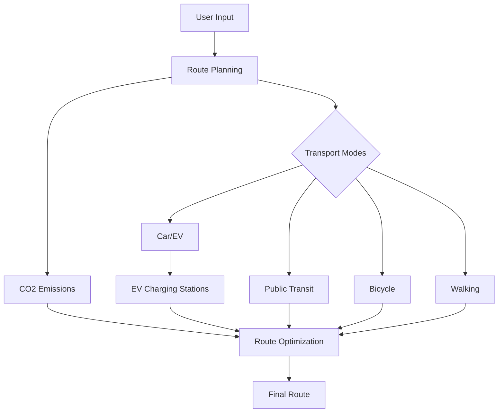
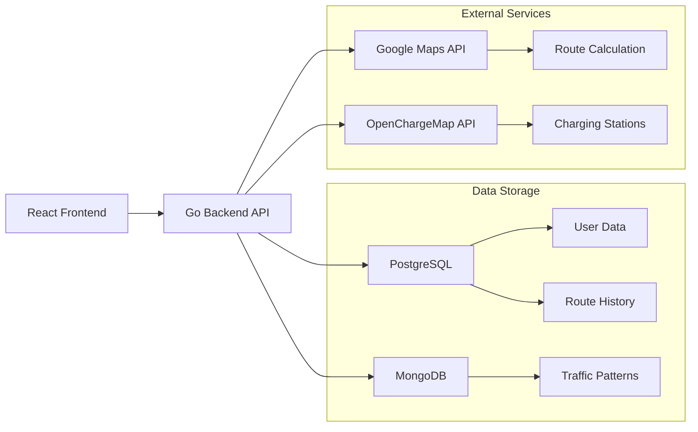
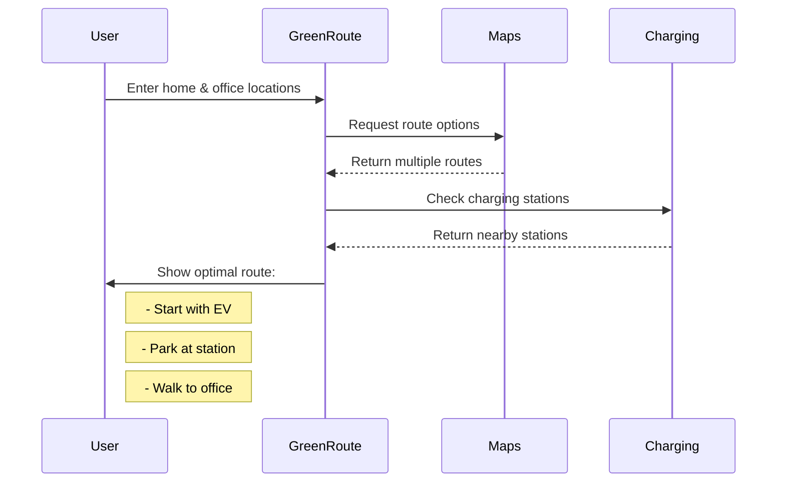
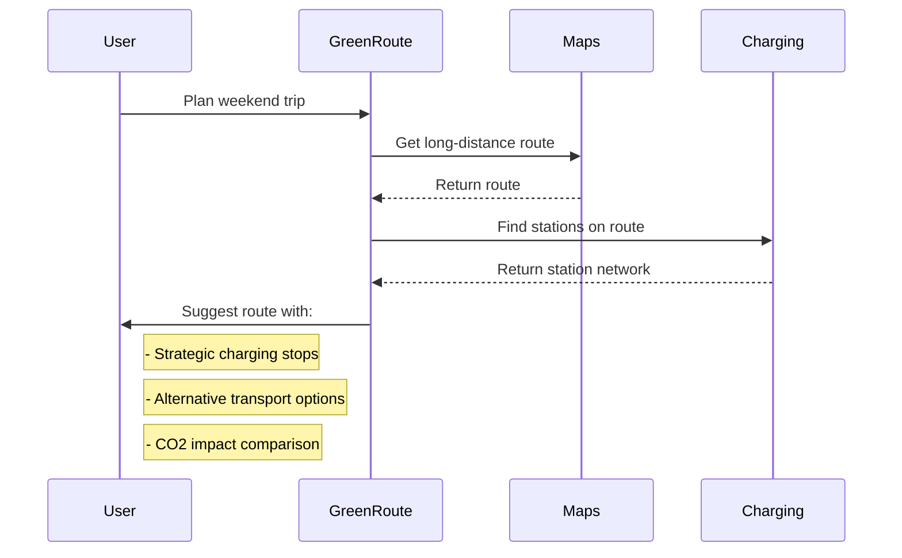

# 🌱 GreenRoute: Sustainable Route Planning

GreenRoute is an eco-conscious route planning application that helps users find the most environmentally friendly ways to travel. By combining multiple transport modes and considering EV charging stations, it optimizes routes for both convenience and minimal environmental impact.

## 🌟 Features



- 🚗 **Multi-modal Transportation**: Combine different transport modes (car, public transit, bicycle, walking)
- ⚡ **EV Charging Integration**: Find charging stations along your route
- 🌍 **CO2 Emission Tracking**: Monitor and minimize your carbon footprint
- 🎯 **Smart Route Optimization**: Balance time, distance, and environmental impact
- 💾 **Route History**: Save and analyze your previous routes
- 🔄 **Real-time Updates**: Traffic patterns and charging station availability

## 🏗️ Architecture



### Frontend Structure
```
frontend/
├── src/
│   ├── components/
│   │   ├── Map.tsx           # Google Maps integration
│   │   ├── RouteForm.tsx     # Route input form
│   │   └── RouteDetails.tsx  # Route information display
│   ├── services/
│   │   └── api.ts           # API client
│   └── types/
│       └── types.ts         # TypeScript definitions
```

### Backend Structure
```
backend/
├── cmd/
│   └── server/
│       └── main.go          # Entry point
├── internal/
│   ├── models/
│   │   └── route.go        # Domain models
│   ├── services/
│   │   └── route_service.go # Business logic
│   ├── external/
│   │   ├── maps_client.go   # Google Maps client
│   │   └── charging_client.go # OpenChargeMap client
│   └── database/
│       ├── postgres.go      # PostgreSQL operations
│       └── mongodb.go       # MongoDB operations
```

## 📋 Example Scenarios

### Scenario 1: Daily Commute


### Scenario 2: Weekend Trip


## 🚀 Getting Started

1. **Prerequisites**
   - Go 1.22 or later
   - Node.js 16 or later
   - PostgreSQL
   - MongoDB

2. **Environment Setup**
   ```bash
   # Backend
   cd backend
   cp .env.example .env
   go mod download
   
   # Frontend
   cd frontend
   npm install
   ```

3. **Running the Application**
   ```bash
   # Backend
   cd backend
   go run cmd/server/main.go
   
   # Frontend
   cd frontend
   npm start
   ```

## 🔑 API Keys Required
- Google Maps API Key
- OpenChargeMap API Key

## 🌱 Environmental Impact

GreenRoute helps reduce CO2 emissions by:
- Optimizing routes for minimal environmental impact
- Encouraging use of public transit and non-motorized transport
- Supporting EV adoption through charging station integration
- Providing emissions data for informed decision-making

## 📊 Future Enhancements

- [ ] Machine learning for route optimization
- [ ] Real-time public transit integration
- [ ] Weather-based route suggestions
- [ ] Social features for sharing green routes
- [ ] Carbon offset tracking and rewards
